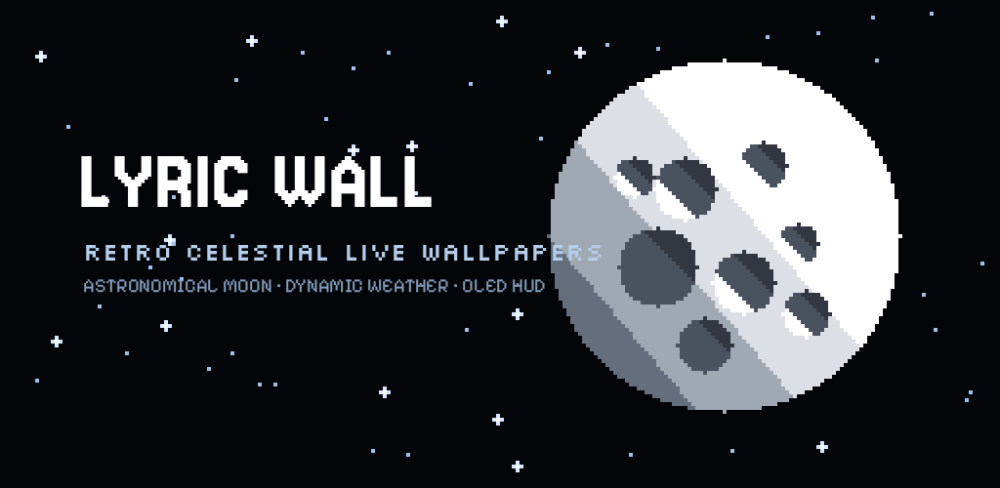

<p align="center">
  
</p>

<h1 align="center">LYRIC WALL</h1>

<p align="center">
  <b>Minimalist retro pixel live wallpapers with real-time astronomical moon phases, dynamic weather, and glanceable retro HUD.</b>
</p>

<p align="center">
  <a href="https://github.com/Rythamo8055/lyric-wall/releases/latest"></a>
  <a href="https://android.com"></a>
  <a href="https://kotlinlang.org"></a>
  <a href="https://developer.android.com/jetpack/compose"></a>
  <a href="PRIVACY_POLICY.md"></a>
  <a href="#license"></a>
</p>

---

## 📖 Overview

**LYRIC WALL** is an authentic retro-futuristic Android personalization engine built from the ground up with 100% pure procedural math and Skia canvas rendering. Unlike traditional video-loop wallpaper apps that consume hundreds of megabytes of RAM and drain your battery, LYRIC WALL renders crisp 8-bit celestial worlds in real time with sub-millisecond hardware draw calls.

<p align="center">
  
</p>

---

## ✨ Key Features

### 🌙 Real Astronomical Lunar Phase Calculations
* Computes exact 3D spherical terminator geometry based on real-time astronomical calendar data.
* Renders authentic lunar relief with crater highlights and stepped monochrome shading across all phases: Waxing Crescent, First Quarter, Waxing Gibbous, Full Moon, Waning, and New Moon.

### ⛅ Dynamic Living Weather Integration
* Procedural weather states: **Clear Cosmic Night**, **Drifting Clouds**, **Pixel Rain** (with ground/edge splash bursts), **Pixel Snow**, and **Stormy Lightning**.
* Syncs with local weather conditions via high-accuracy GPS or manually selected cities using secure HTTPS queries to Open-Meteo.

### 🔋 OLED True-Black Battery Efficiency
* **0.0% CPU Standby:** Rendering loop automatically cancels via `Choreographer.FrameCallback` whenever your screen turns off or another application is active.
* **True `#000000` AMOLED Canvas:** Inactive pixels are physically turned off on OLED displays, drawing zero power on black backgrounds.
* **Batched Native GPU Drawing:** Uses hardware-accelerated `Canvas.drawPoints` and `Canvas.drawLines` through `SurfaceHolder.lockHardwareCanvas()`, slashing frame draw times to less than 1 ms.

### 📊 Glanceable Side-Rail Productivity HUD
* Retro digital clock (`HH:mm`) and live date formatted in authentic 8-bit monospace typography.
* Battery percentage meter synchronized via system `BatteryManager` broadcast receiver.
* Real-world location tag and live ambient temperature.
* Mindful daily screen unlock counter that resets automatically at midnight.
* Strategically positioned in safe display areas to avoid collisions with punch-hole cameras, status bars, and dock icons.

### ⚡ Direct Touch Interactivity
* **Sky Tap:** Summons shooting stars with fading particle tails across the night sky.
* **Moon Tap:** Triggers expanding lunar shimmer waves and celestial atmospheric transitions.

### 🎨 Home & Lock Screen Freedom
* **Live Wallpaper:** Activates dynamic interactive animation via Android's native `WallpaperService`.
* **Static Snapshot:** Renders a crystal-clear 1080×2400 procedural image and applies it strictly to your Home Screen, Lock Screen, or both.

---

## 🛠 Tech Stack & Architecture

* **Language:** [Kotlin](https://kotlinlang.org/) (JVM 21)
* **UI Framework:** [Jetpack Compose](https://developer.android.com/jetpack/compose) with Material 3 & Navigation 3
* **Rendering Engine:** Custom hardware-accelerated Skia 2D Canvas with sub-millisecond batched geometry
* **Weather API:** [Open-Meteo](https://open-meteo.com/) (No API keys required, zero telemetry tracking)
* **Min SDK:** Android 8.0 (API Level 24)
* **Target SDK:** Android 16 (API Level 36)
* **App Footprint:** Only **~1.8 MB** (no heavy video assets or bloated textures)

---

## 📁 Project Structure

```text
wallpaper-app/
├── app/
│   ├── src/main/
│   │   ├── AndroidManifest.xml          # Services, permissions & entry activity
│   │   ├── java/com/example/luminawallpapers/
│   │   │   ├── service/                 # Android WallpaperService engine
│   │   │   ├── wallpaper/               # Celestial 8-bit procedural renderers
│   │   │   ├── ui/                      # Jetpack Compose screens & components
│   │   │   ├── data/                    # Weather & preference repositories
│   │   │   └── util/                    # Astronomical math & location helpers
│   │   └── res/                         # Vector drawables, themes & strings
│   └── build.gradle.kts                 # App build configuration & dependencies
├── play_store_assets/
│   ├── app_icon_512.png                 # Official 512x512 Google Play Icon
│   ├── feature_graphic_1024x500.png     # Official 1024x500 Feature Banner
│   ├── LYRIC_WALL_release.aab           # Production Google Play App Bundle
│   └── LYRIC_WALL_release.apk           # Direct-install release APK
├── PRIVACY_POLICY.md                    # Official Public Privacy Policy
└── build.gradle.kts                     # Root project configuration
```

---

## 🚀 Building & Running

### Prerequisites
* JDK 21+
* Android SDK (API Level 36)
* Android Studio Ladybug or later (optional)

### Build Commands

```bash
# Clone the repository
git clone https://github.com/Rythamo8055/lyric-wall.git
cd lyric-wall

# Assemble Debug APK
./gradlew :app:assembleDebug

# Build Signed Release Android App Bundle (.aab) for Google Play
./gradlew :app:bundleRelease

# Assemble Release APK (.apk)
./gradlew :app:assembleRelease
```

### Direct Install via ADB

```bash
adb install -r play_store_assets/LYRIC_WALL_release.apk
```

---

## 🔒 Privacy Policy

LYRIC WALL is built with privacy at its foundation:
* **No Advertisements:** Zero ad network SDKs.
* **No User Tracking:** Zero analytics or user behavioral tracking.
* **Local Processing:** Screen unlock statistics and preferences remain strictly on your device.
* **Ephemeral Location:** Location permissions are used solely to query local weather and solar/lunar terminators.

Read the complete [Privacy Policy](PRIVACY_POLICY.md).

---

## 📄 License

This project is licensed under the MIT License - see the [LICENSE](LICENSE) file for details.
